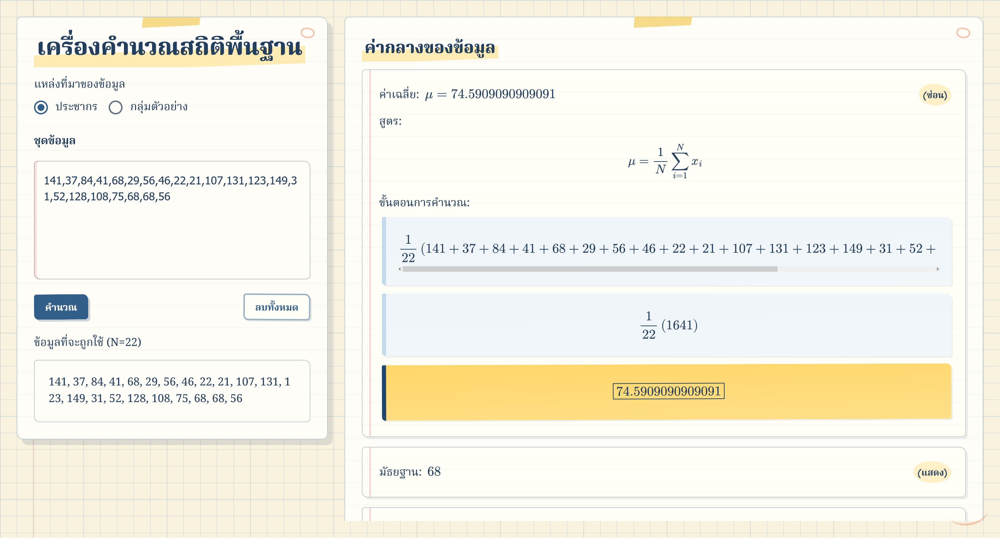
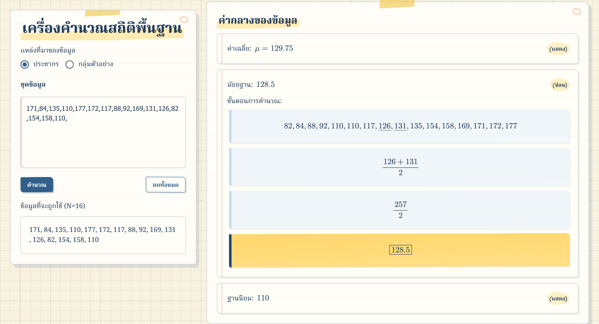
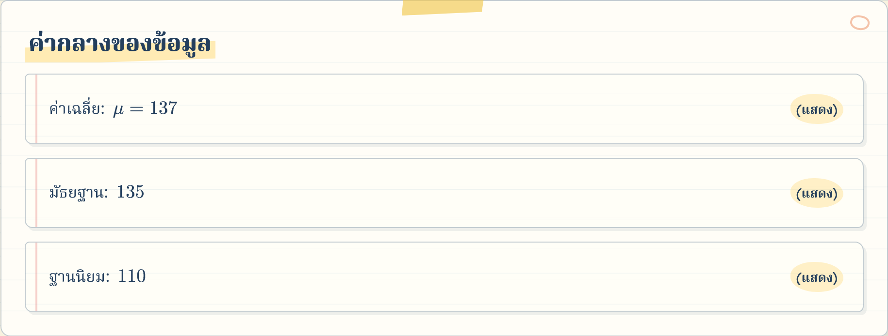
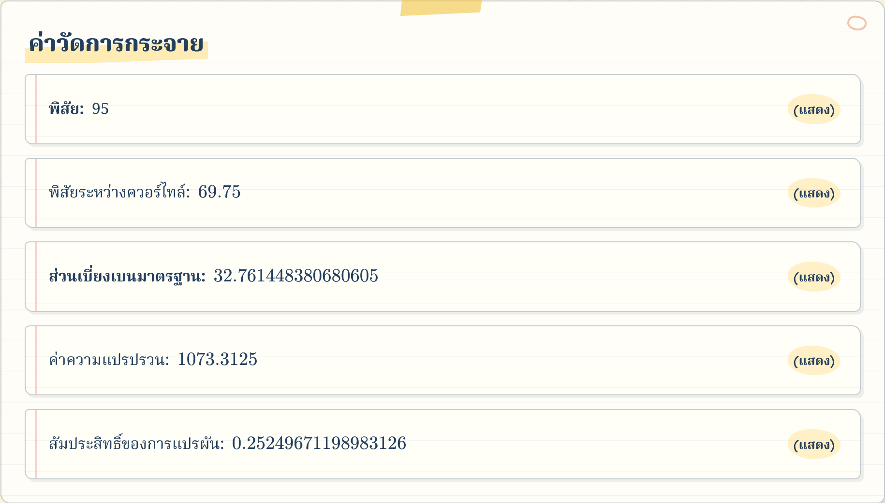
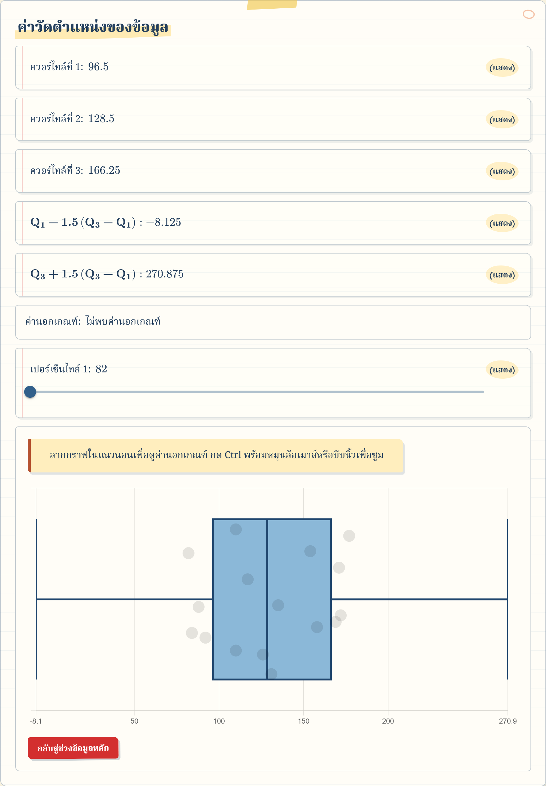

> Visualize and see step-by-step calculation of common measures of a data set

# ~Statistics Visualizer

Lightweight, interactive visualizer for common data set measures (center, dispersion, and position) powered by ChartJS comes equipped with step-by-step calculation hints to see how these values are computed.

## Step-by-step Calculation

## Measures of Center

## Measures of Dispersion

## Measures of Position

